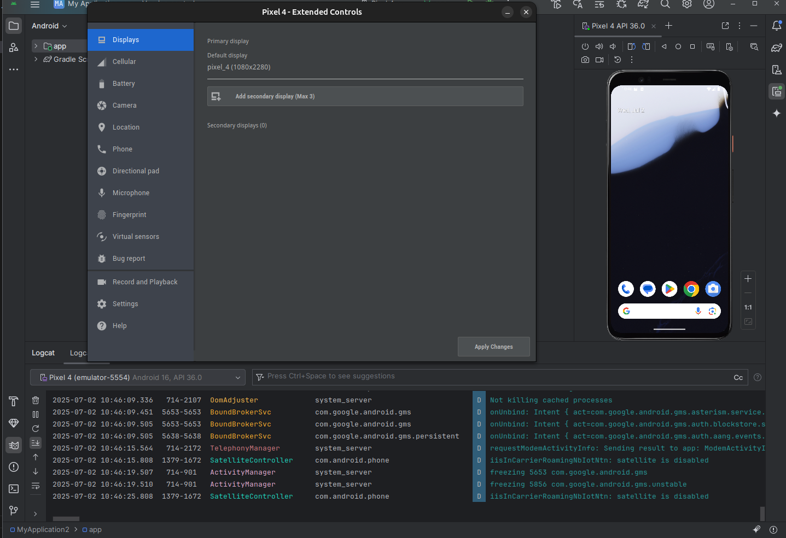
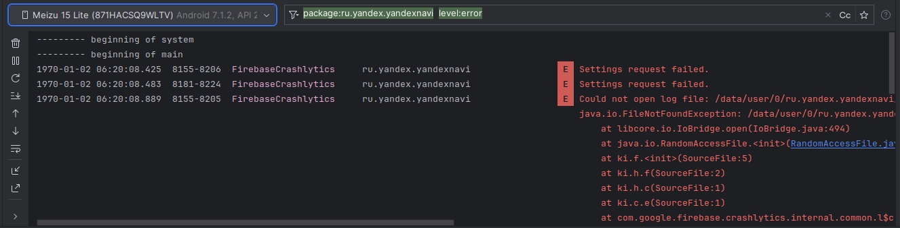

# Android Studio

## Создание эмулятора в Android Studio

**Эмулятор Android** — это виртуальное устройство, которое имитирует работу реального смартфона или планшета на базе Android. Он позволяет запускать, тестировать и отлаживать приложения без необходимости использования физического устройства.

**Основные возможности эмулятора в Android Studio:**
- Тестирование приложений – можно запускать APK-файлы и проверять их работу на разных версиях Android.

- Различные конфигурации устройств – эмулируются разные модели (Pixel, Samsung и др.) с разными разрешениями экрана и характеристиками.

- Разные версии Android – можно тестировать приложения на старых и новых версиях ОС (Android 5.0 Lollipop, Android 13 и т. д.).

- Отладка – можно использовать Logcat, Debugger и другие инструменты разработчика.

- Имитация различных условий:

    - Разное подключение (Wi-Fi, 4G, медленный интернет).

    - Изменение ориентации экрана (альбомная/портретная).

    - Эмуляция GPS-координат.

    - Имитация звонков, SMS, низкого заряда батареи.

Для того, чтобы создать эмулятор необходимо выполнить следующие шаги:
1. Открыть Android Studio.
2. Создать новый проект, нажав на вкладку ```New Project```.
3. Выполнить настройку проекта заполнив графы:
    - Name - имя проекта
    - Package name - имя сборки проекта
    - Sаve location - путь расположения проекта
    - Language - язык разработки
    - Minimum SDK - самая ранняя версия Android, на которой может работать приложение
    - Build сonfiguration language - языки конфигурации сборки для настройки компиляции, зависимостей и других настроек сборки 
4. Нажать на кнопку ```Finish```, чтобы завершить настройку и перейти к проекту. 
5. Нажать на вкладку ```Device Manager``` в правой панеле инструментов.
6. В открывшейся панели нажать на ```+```(add new device) и нажать на ```Create Virtual Device```.
7. Выбрать "Form Factor",  можно выбрать телефон, планшет, тв-приставку или др.
8. Выбрать устройство с пометкой "Play Store" в столбце "Play" (например, Pixel 4).
9. Выбрать образ системы с API уровня, помеченного как "Google Play" (например, "R" API 30).
10. Завершить настройку, нажав на кнопку ```Finish```.
11. Для старта эмулятора нужно нажать на кнопку ```Start``` напротив виртуального устройста.

После того как эмуляция запустится можно работать с устройствой стандартными жестами, полностью использовать функционал данного устройства виртуально и отслеживать логи.

В верхней панеле ```Manager Device``` расположены кнопки тул-бара, клавиши громкости и смены ориентации, а если нажать на ```Extended Controls```, то появится панель для настройки, где можно конфигурировать разные состояния устройста (например, сетевые подключения, заряд устройства и др.), а так же делать скриншоты, видеозаписи и оформлять баг-репрты.



---

## Включение режима разработчика мобильного телефона.

Для разных телефонов процесс включения режима разработчика схож. Нужно выполнить следующие шаги:

1. Зайти в настройки телефона и выбрать меню ```О телефоне``` / ```Об устройстве```.
2. Найти заголовок ```Версия прошивки``` / ```Номер версии```, и выполнить 7 быстрых нажать, после чего появится сообщение, что теперь вы разработчик.
3. Далее нужно вернуться в настройки телефона и зайти в меню ```Дополнительные настройки``` / ```Спец. настройки``` и перейти в меню ```Возможности разработчика``` / ```Для разработчиков``` и включить функцию ```Отладка по USB```, чтобы в дальнейшем можно было подключить телефон к Android Studion через USB-кабель.

Настройка производилась на телефонах Realme 10 и Meizu 15 lite.

## Просмотр логов Logcat

Чтобы работать с логами в Logcat, необходимо подключить свое устройсто или запустить эмулятор в Android Studio.

Открыть окно Logcat можно двумя способами:

- Меню `View` → `Tool Windows` → `Logcat`
- Комбинация клавиш Shift+Shift и ввод команды «logcat»

**Логи (Logcat)** в Android Studio — это системный журнал, который записывает все события, происходящие в приложении и системе Android. Они помогают:

- Находить ошибки (Exceptions, Crashes)
- Отслеживать работу приложения
- Анализировать производительность


### Фильтрация логов

| Уровень      | Описание                                      | Пример                          |
|--------------|-----------------------------------------------|---------------------------------|
| **Verbose (V)** | Подробная техническая информация              | `D/Network: Trying to connect...` |
| **Debug (D)**   | Отладочные сообщения (для разработчиков)      | `D/MainActivity: Button clicked` |
| **Info (I)**    | Важная информация о работе приложения         | `I/System: App started`          |
| **Warning (W)** | Потенциальные проблемы (но не ошибки)         | `W/Activity: onStop() took too long` |
| **Error (E)**   | Критические ошибки (приложение может работать)| `E/AndroidRuntime: NullPointerException` |
| **Assert (A)**  | Критические сбои (приложение падает)          | `A/libc: Fatal signal 11`        |

**Фильтрация по уровню Verbose, Debug, Info, Warn, Error**

```level:error``` -фильтр по этому тегу выведет только ошибки(Errors).

**Фильтрация по тегу (TAG)**


```Log.d("MyAppTag", "This is a debug message")``` - фильтр по этому тегу позволит увидеть именно мои сообщения.

**Фильтрация по процессу**

```package:ru.yandex.yandexnavi``` - фильтр по этому тегу выведет логи только по этому приложению.

Так же можно компоновать фильтры

```package:ru.yandex.yandexnavi  level:error``` - фильтр по этому тегу только тоги ошибок в дфнном приложении.



## Создание эмулятора в  Xcode

**Эмулятор в Xcode** — это инструмент, который позволяет запускать и тестировать приложения для iOS, iPadOS, watchOS и tvOS прямо на Mac без необходимости использования реальных устройств.

**Основные возможности эмулятора в Xcode:**

- Запуск приложений без реального iPhone/iPad.
- Тестирование на разных моделях (iPhone 15, iPhone SE, iPad Pro и др.).
- Смена версий iOS (если установлены разные SDK).
- Имитация жестов (тапы, свайпы, повороты).
- Тестирование разных условий:
    - Темный/светлый режим.
    - Разные размеры экрана.
    - Имитация медленного интернета (Network Link Conditioner).
- Отладка через Console и Instruments.

    - Разное подключение (Wi-Fi, 4G, медленный интернет).
    - Изменение ориентации экрана (альбомная/портретная).

    - Эмуляция GPS-координат.

    - Имитация звонков, SMS, низкого заряда батареи.

Для того, чтобы создать эмулятор необходимо выполнить следующие шаги:
1. Открыть Xcode.
2. Создать новый проект, нажав на вкладку ```Create New Project```,  если нет созданного проекта.
3. Выбрать "Form Factor",  например iOS, и выбрать шаблон, например "App".
4. Выполнить настройку проекта заполнив графы:
- Название проекта (Product Name)
- Команда (Team), выберите ваш Apple ID (или команду разработчиков, если есть аккаунт в Apple Developer Program). Если аккаунта нет, оставьте "None" (но для публикации в App Store он понадобится).
- Organization Identifier (идентификатор организации) – это важная настройка, которая влияет на Bundle ID вашего приложения.
- Идентификатор (Bundle Identifier)
- Язык (Language), Swift (рекомендуется) или Objective-C (для старых проектов).
- Интерфейс (Interface), SwiftUI (современный, декларативный подход) или Storyboard (визуальный редактор).
- Storage 
    -  None – Без встроенного хранилища (добавите позже вручную).
    - SwiftData – Новый фреймворк Apple (iOS 17+), замена Core Data.
    - Core Data – Классическая ORM-система Apple (поддержка старых iOS).
- Тесты (Include Tests)

5. Нажать на кнопку ```Finish```, чтобы завершить настройку и перейти к проекту. 

6. Верхнем поле цели для запуска проекта, найди выпадающий список с устройствами и выбрать подходящее устройство (например, iPhone 14 Pro Max или iPad Air).

**Если нужного устройства нет в списке**, перейдем к следующему шагу, чтобы создать новое устройство:
- Нажать на ```Devices and Simulators``` в верхней строке меню (это пункт находится в меню Window > Devices and Simulators). Откроется окно управления устройствами и симуляторами.
- Перейти на вкладку ```Simulators```.
- Нажмать кнопку ```+``` внизу окна, чтобы создать новый симулятор.
- В появившемся окне выбрать тип устройства (например, iPhone SE (3rd generation)) и версию операционной системы (например, iOS 16.4).
- Подтвердить выбор, нажав ```Create```.

Теперь твой новый эмулятор появился в списке устройств.

7. Верхнем поле цели для запуска проекта, найди выпадающий список с устройствами и выбрать подходящее устройство или вновь созданный эмулятор и нажми кнопку Run (обычно изображается зелёной стрелкой или клавиатурной комбинацией ⌘R).


Появится запущенный эмулятор с открытым проектом.

Можешь взаимодействовать с приложением, тестируя интерфейс и функциональные возможности.
Используя вкладку Debug Navigator, можно мониторить потребление ресурсов, просмотры логов и профилирование приложения.
